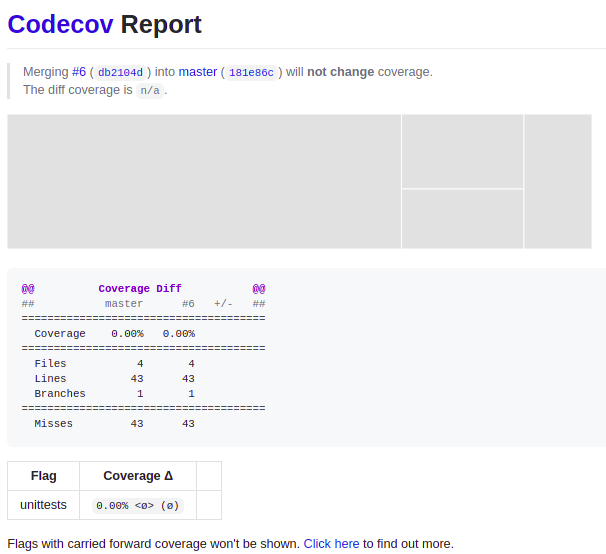

<div>
  <h1 align="center">
    GCES 2020.02 - Trabalho Individual
  </h1>
  <p align="center">
      <a href="https://codeclimate.com/github/WelisonR/Trabalho-Individual-2020-2/maintainability"></a>
      <a href="https://codeclimate.com/github/WelisonR/Trabalho-Individual-2020-2/test_coverage"></a>
      <a href="https://codecov.io/gh/WelisonR/Trabalho-Individual-2020-2"></a>
      <a href="https://github.com/WelisonR/Trabalho-Individual-2020-2" target="_blank" alt="Project Pull Requests">
      <br/>
      <a href="https://github.com/WelisonR/Trabalho-Individual-2020-2/actions/workflows/backend-ci.yml" target="_blank" alt="Back-end CI">
      <a href="https://github.com/WelisonR/Trabalho-Individual-2020-2/actions/workflows/backend-cd.yml" target="_blank" alt="Back-end CD">
      <a href="https://github.com/WelisonR/Trabalho-Individual-2020-2/actions/workflows/frontend-ci.yml" target="_blank" alt="Front-end CI">
      <a href="https://github.com/WelisonR/Trabalho-Individual-2020-2/actions/workflows/frontend-cd.yml" target="_blank" alt="Front-end CD">
  </p>
</div>
## <p align="left"><a href="https://agitated-goldwasser-21e397.netlify.app/">Utilize a aplicação em produção</a></p>

## Rode a Aplicação com Docker-compose

### Dependências

Inicialmente, instale localmente as seguintes dependências:

1. Instale o [Docker](https://docs.docker.com/install/linux/docker-ce/ubuntu/);
2. Instale o [Docker Compose](https://docs.docker.com/compose/install/).

### Arquivos de Configuração

1. Crie um arquivo `.env` na raiz do projeto;
2. Copie para o arquivo `.env` as configurações definidas no arquivo `.env-reference`.

### Inicialização do Projeto

1. Na pasta principal do projeto, construa e inicialize a aplicação com o comando:

```bash
sudo docker-compose up --build
```

2. Após inicializada a aplicação, os recursos do sistema estarão disponíveis nos links abaixo:

- Front-end: `http://localhost:8080/`;
- Back-end: `http://localhost:8000/task` (com postgres rodando na porta 5432).

**Observação**: se necessário remover o que foi criado com o docker-compose, utilize o comando `sudo docker-compose down -v` na raiz do projeto.

## Containerização

Realizou-se o provisonamento do ambiente com base em três serviços, orquetrados e definidos pelo arquivo [docker-compose](https://github.com/WelisonR/Trabalho-Individual-2020-2/blob/master/docker-compose.yml):

- Banco de dados: serviço do banco de dados postgreSQL, com mapeamento de volume da base de dados, definidos no arquivo [docker-compose](https://github.com/WelisonR/Trabalho-Individual-2020-2/blob/master/docker-compose.yml);
- Back-end: serviço que utiliza o _framework_ django e funciona como `api` da aplicação. Definiu-se um arquivo [Dockerfile](https://github.com/WelisonR/Trabalho-Individual-2020-2/blob/master/api/Dockerfile) de configuração de ambiente, além de um [Ponto de Entrada do back-end](https://github.com/WelisonR/Trabalho-Individual-2020-2/blob/master/api/docker-entrypoint.sh);
- Front-end: serviço que utiliza o _framework_ quasar e funciona como interface da aplicação. Definiu-se um arquivo [Dockerfile](https://github.com/WelisonR/Trabalho-Individual-2020-2/blob/master/client/Dockerfile) de configuração de ambiente.


## Integração Contínua

Utiliza-se diversos serviços para realizar a integração contínua do projeto. Nesse sentido, pode-se destacar os serviços abaixo.

### GitHub Actions

Acesse as definições das GitHub Actios no link: [GitHub Actions](https://github.com/WelisonR/Trabalho-Individual-2020-2/tree/master/.github/workflows).

Utilizou-se o GitHub Actions para executar todas as etapas de integração contínua do projeto. Foram definidas duas ações de integração contínua:

- [Integração contínua do Front-end](https://github.com/WelisonR/Trabalho-Individual-2020-2/blob/master/.github/workflows/frontend-ci.yml):
  - Constrói a imagem do ambiente;
  - Verifica a folha de estilo com a ferramenta `eslint` com base nas definições dos [arquivos de definição do eslint](https://github.com/WelisonR/Trabalho-Individual-2020-2/tree/master/client);
  - Roda os testes e gera relatórios com a ferramenta `jest`;
  - Publica os relatórios de teste para o serviço `codecov`.
- [Integração contínua do Back-end](https://github.com/WelisonR/Trabalho-Individual-2020-2/blob/master/.github/workflows/backend-ci.yml):
  - Constrói a imagem do ambiente;
  - Verifica a folha de estilo com a ferramenta `flake8` com base nas definições do arquivo [setup.cfg](https://github.com/WelisonR/Trabalho-Individual-2020-2/blob/master/api/setup.cfg);
  - Roda e gera relatórios dos testes com a ferramenta `coverage`;
  - Publica os relatórios de teste para o serviço `code climate`.

Caso alguma etapa não tenha sido bem-sucedida, o pipeline é finalizado com erro.

[](https://github.com/WelisonR/Trabalho-Individual-2020-2/actions)

### Code Climate

O serviço Code Climate foi configurado com a finalidade de realizar análise de qualidade de código de toda a aplicação, além de gerar análises com base nos resultados de testes do back-end.

- Acesse os relatórios do Code Climate no link: [Análise Code Climate](https://codeclimate.com/github/WelisonR/Trabalho-Individual-2020-2).


### Codecov

O serviço Codecov foi configurado para gerar análises com base nos resultados de testes do front-end.

- Acesse os relatórios de teste do Codecov no link: [Análise Codecov](https://app.codecov.io/gh/WelisonR/Trabalho-Individual-2020-2/).



### Restrições de _Branchs_ e _Pull Requests_

Antes de integrar mudanças a _branch_ padrão, _master_, devem ser observados os seguintes pontos:

1. _Pull request_ deve ter ao menos uma revisão;
2. As etapas de integração contínua devem rodar adequadamente, com as seguintes observações:
   1. A etapa de integração contínua do back-end do GitHub Actions deve finalizar com sucesso;
   2. A etapa de integração contínua do front-end do GitHub Actions deve finalizar com sucesso;
   3. Cobertura de testes do back-end deve estar superior a 90% (code climate);
   4. Cobertura de testes do front-end não pode ter uma queda na porcentagem de cobertura (codecov);
   5. Validação de qualidade de código do code climate apresentar resultados positivos.

Além disso, são gerados comentários do codecov, do code climate nos _pull requests_ em relação a qualidade de código e testes da aplicação.


### Deploy Contínuo

Para realizar o deploy contínuo da aplicação, utilizou-se ações do GitHub Actions.

### Front-end

Realizou-se o deploy contínuo do front-end com o uso do serviço [Netlify](https://www.netlify.com/).

Link para acessar o ambiente de produção do front-end: [Front-end em produção](http://glacial-harbor-86827.herokuapp.com/task/).

Ações do GitHub Actions:

- [Deploy contínuo do front-end](https://github.com/WelisonR/Trabalho-Individual-2020-2/blob/master/.github/workflows/frontend-cd.yml): disparado no momento em que uma nova mudança é integrada à _branch_ master. É realizada a construção e a entrega da aplicação no serviço Netlify.

### Back-end

Realizou-se o deploy contínuo do back-end com o uso do serviço [Heroku](heroku.com). O heroku realiza o provisionameto da infraestrutura tanto do back-end como do banco de dados (postgreSQL).

Link para acessar o ambiente de produção do back-end: [Back-end produção](http://glacial-harbor-86827.herokuapp.com/task/).

Ações do GitHub Actions:

- [Deploy contínuo do back-end](https://github.com/WelisonR/Trabalho-Individual-2020-2/blob/master/.github/workflows/backend-cd.yml): disparado no momento em que uma nova mudança é integrada à _branch_ master. É realizada entrega da aplicação no serviço Heroku.

## Autor

| Matrícula  | Estudante                   |
| ---------- | --------------------------- |
| 17/0024121 | Welison Lucas Almeida Regis |
